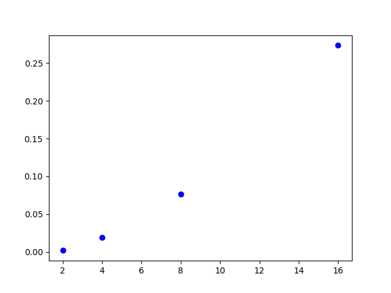
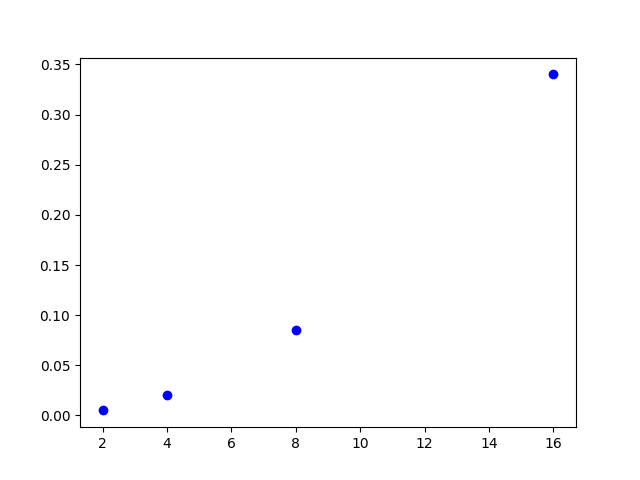

# Κατανεμημένα Συστήματα, NTUA 2017 - 2018

## Αναφορά εξαμηνιαίας εργασίας

### Ομάδα 34

| | |
| -- | -- | 
| Γαβαλάς Νίκος | 03113121 |
| Καραμέρης Μάρκος | 03113148 |

---

## Περιγραφή

Το ζητούμενο είναι η κατασκευή ενός group messenger, αποτελούμενο από clients (υπεύθυνοι για τη διαχείριση των μηνυμάτων των groups στα οποία ανήκουν) και έναν tracker, που κρατάει μια εικόνα για την κατάσταση των groups και απαντάει σε αιτήματα των clients, όταν αυτοί θέλουν να βρουν/δημιουργήσουν groups και άλλους clients-peers.

### Απαιτήσεις

1. Η επικοινωνία με τον tracker πρέπει να είναι reliable. Η επικοινωνία μεταξύ των clients σε κάθε group είναι fault tolerant (δηλ. και να χαθεί κάποιο μήνυμα δεν μας πειράζει τόσο).
 
2. Ο κάθε client πρέπει να λαμβάνει τα μηνύματα με τη σειρά που στέλνονται προς αυτόν. 

3. Πρέπει επίσης να υπάρχει η δυνατότητα ολικής ορθής διάταξης των μηνυμάτων στο group.

4. Ο tracker πρέπει να είναι σε θέση να ανιχνεύει clients που έχουν αποτύχει και να τους αφαιρεί από τις δομές του.

### Υλοποίηση

Σε αντιστοιχία με τα άνωθι:

1. Για reliable επικοινωνία με τον tracker χρησιμοποιούνται TCP sockets. Για τα μηνύματα μεταξύ των clients, UDP sockets.

2. Γίνεται χρήση FIFO ordering, με βάση την οποία ο κάθε client κρατάει έναν buffer για κάθε group στο οποίο ανήκει, και έναν counter για τα μηνύματα του ίδιου group. Παράλληλα, κάθε μήνυμα που κάνει broadcast στο group, το μαρκάρει με τον counter του. Ομοίως και οι υπόλοιποι clients του ίδιου group. 
Έτσι, για να δεχτούν μήνυμα ελέγχουν αν με βάση τον counter τους (και τον counter του μηνύματος) είναι αυτό που αναμένουν, οπότε και το δέχονται και αυξάνουν τον group counter τους για τον συγκεκριμένο client απ' όπου ήρθε το μήνυμα, ή το βάζουν στον buffer τους και περιμένουν πρώτα τα χαμένα ενδιάμεσα μηνύματα, για να τα παραδώσουν ύστερα με τη σωστή σειρά στην εφαρμογή.

3. Για ολική διάταξη χρησιμοποιείται ένας "ειδικός" client, ένας sequencer, που χρειάζεται να ξέρει μόνο ο tracker. Ο sequencer δέχεται μηνύματα από τους clients, τα διατάσσει κατά FIFO και τα επαναπροωθεί στο group (και ύστερα κάθε client χρησιμοποιεί FIFO για τον εαυτό του).

4. Kάθε client κάνει χρήση ενός background thread που ανά συγκεκριμένο χρονικό διάστημα (δεδομένο στον tracker) στέλνει ένα UDP πακέτο (heartbeat). Αν ο tracker δεν λάβει τέτοιο πακέτο για κάποιον cient για διάστημα μεγαλύτερο του διπλάσιου αυτής της δεδομένης διάρκειας, θεωρεί ότι απέτυχε και τον διαγράφει από τις δομές του.

Ως γλώσσα επιλέχθηκε η Python (v.3.5). Τα μηνύματα στα sockets ανταλάσσονται με τη μορφή json (θα μπορούσε να χρησιμοποιηθεί pickle αλλά τα jsons είναι πιο απλά και υποστηρίζονται και από άλλες γλώσσες).

### Σχεδιαστικές Αποφάσεις

- Για αποδοτική χρήση Ι/Ο αντί για πολλαπλά threads στα input streams (socket και stdin) (που εισάγουν overhead και είναι γενικά βαριά) χρησιμοποίησαμε το unix syscall "select", που τίθεται να παρακολουθεί streams και "ειδοποιεί" όταν κάποιο από αυτά έχει δεδομένα και είναι ready.
- Για την αντιμετώπιση της "άγνοιας" της κατάστασης του group σε περίπτωση που κάποιος εισέρχεται (και οι άλλοι πρέπει να τον μάθουν χωρίς να ρωτάνε συνέχεια τον tracker), ή αντίστοιχα εξέρχεται (οπότε και πρέπει να σταματήσουν να τον συμπεριλαμβάνουν στα broadcasts τους), χρησιμοποιήσαμε control messages μεταξύ των clients (πέρα από τα application messages). Συγκεκριμένα, όταν ένας client εισέρχεται σε ένα group, στέλνει σε όλους (που ξέρει ποιοι είναι γιατί του έχει πει ο tracker), ένα ειδικό μήνυμα `client hello` και αντίστοιχα όταν βγαίνει ένα `client bye`. Τα μηνύματα αυτά τα χειρίζονται οι clients για να ενημερώσουν τις δομές τους.
- Για την σωστή λειτουργία του FIFO ordering σε κάθε group, απαιτείται σωστή αρχικοποίηση του αντίστοιχου counter. Με αυτό εννοούμε πώς, μπαίνοντας σε ένα group, ένας client, δεν θέλουμε να έχει αρχικοποιημένο τον counter του στο 0, γιατί τότε θα περιμένει μήνυμα με counter 1, το οποίο (αν όσοι είναι group έχουν ήδη ανταλλάξει μερικά μηνύματα) δεν έρθει ποτέ, με αποτέλεσμα ο εν λόγω client να βάζει στον buffer του στο εξής όλα τα μηνύματα που του έρχονται. Επομένως κάναμε την σύμβαση, με το που εισέρχεται στο group, να αρχικοποιεί τον counter του στο πρώτο μήνυμα που λαμβάνει για κάθε client. Με αυτο τον τρόπο "συγχρονίζεται" στο group και μπορεί να επικοινωνήσει κανονικά στο εξής.
<!-- buffer flush? -->

### Χρήση των προγραμμάτων

client.py

```
$ python3 client.py -h
usage: client.py [-h] [-t T] [-s] [-v] addr name tracker_addr

positional arguments:
  addr          the client's address in the form of host:port (e.g.
                123.123.123.123:12345)
  name          username
  tracker_addr  the tracker's address in the form of host:port (e.g.
                123.123.123.123:12345)

optional arguments:
  -h, --help    show this help message and exit
  -t T          execute tests (emulation mode) - provide file
  -s            use sequencer for total ordering
  -v            verbose output (use for debugging)
```

tracker.py

```
$ python3 tracker.py -h
usage: tracker.py [-h] [-b B] [-v] [--seq_addr SEQ_ADDR] addr

positional arguments:
  addr                 the tracker's address in the form of host:port (e.g.
                       123.123.123.123:12345)

optional arguments:
  -h, --help           show this help message and exit
  -b B                 backlog of tracker's socket, default is 10
  -v                   verbose output (use for debugging)
  --seq_addr SEQ_ADDR  use for total ordering - the sequencer's address in the
                       form of host:port (e.g. 123.123.123.123:12345)
```

sequencer.py

```
$ python3 sequencer.py -h
usage: sequencer.py [-h] [-v] addr

positional arguments:
  addr        the sequencer's address in the form of host:port (e.g.
              123.123.123.123:12345)

optional arguments:
  -h, --help  show this help message and exit
  -v          verbose output (use for debugging)
```

---

<!-- TODO -->

## Πειράματα

Για τα χρονικά διαστήματα στα παρακάτω πειράματα χρησιμοποιήθηκε το system time. Κανονικά κάτι τέτοιο δεν είναι πολύ ακριβές, αλλά επειδή η υποδομή του εργαστηρίου που μας δόθηκε αποτελείται από 5 hosts που βρίσκονται σε Docker containers, και το Docker χρησιμοποιεί το ρολόι του host συστήματος, αυτό σημαίνει ότι όλοι οι hosts έχουν ακριβώς το ίδιο ρολόι. Οπότε οι μετρήσεις για διαστήματα είναι reliable χωρίς να χρειαστεί να συγχρονίζουμε ρολόγια κλπ. 

**Σημείωση**: Όλες οι μετρήσεις, όπως τις τύπωναν τα tests βρίσκονται σε μορφή markdown στο αρχείο measurements.md. Λόγω του τεράστιου πλήθους τους, εδώ συμπεριλαμβάνουμε μόνο τα αποτελέσματα των υπολογισμών και όχι την αναλυτική επεξεργασία τους.

### Deployment

To deployment είναι πλήρως αυτοματοποιημένο με το tests.py:

```
$ python3 tests.py -h
usage: tests.py [-h] [-t] [-c] n p test_num

positional arguments:
  n           number of clients
  p           base port
  test_num    1 for first test, 2 for second

optional arguments:
  -h, --help  show this help message and exit
  -t          use total ordering (sequencer)
  -c          close all remote processes
```

To script αυτό σηκώνει τους clients με κατάλληλες παραμέτρους στα remote μηχανήματα μέσω ```ssh```, και κρατάει τη σύνδεση ανοιχτή μέχρι να τυπώσουν τις μετρήσεις τους με χρήση ```screen```

---

### **Πείραμα 1**: Απόδοση του συστήματος 

#### a) FIFO Ordering

```
$ python3 tests.py 5 46663 1
```

| username | elapsed time |
| -- | -- |
| client0 | 0.018443 |
| client1 | 0.009312 |
| client2 | 0.008166 |
| client3 | 0.009989 |
| client4 | 0.014044 |

**Μετρικές**:
- **Throughput** (αρ. μηνυμάτων : 10)
  
  | username | throughput |
  | -- | -- |
  | client0 | 0.0018443 |
  | client1 | 0.0009312 |
  | client2 | 0.0008166 |
  | client3 | 0.0009989 |
  | client4 | 0.0014044 |

  Συνολικό throughput: sum = 0.00059954

- **Latency**

  Μέσο latency περίπου 0.000503 sec

- **Cost**

  Συνολικά Control Messages με Tracker: 1 * 5 = 5

  Συνολικά 'ClientHello' μηνύματα: 1+2+3+4+5 = 15

  Συνολικά Application μηνύματα: 10 * 5 = 50

  Σύνολο: 70


#### b) FIFO & Total Ordering

```
$ python3 tests.py -t 5 46663 1
```

| username | elapsed time |
| -- | -- | -- |
| client0 | 0.012383 |
| client1 | 0.015420 |
| client2 | 0.010478 |
| client3 | 0.010653 |
| client4 | 0.016050 |

**Μετρικές**:

- **Throughput** (αρ. μηνυμάτων : 10)
  
  | username | throughput |
  | -- | -- |
  | client0 | 0.0012383 |
  | client1 | 0.0015420 | 
  | client2 | 0.0010478 |
  | client3 | 0.0010653 |
  | client4 | 0.0016050 |

  Συνολικό throughput: sum = 0.00064984

- **Latency**

  Μέσο latency περίπου 0.000503 sec

- **Cost**

  Συνολικά Control Messages με Tracker: 1 * 5 = 5

  Συνολικά 'ClientHello' μηνύματα: 1+2+3+4+5 = 15

  Συνολικά Application μηνύματα: 10 * 5 = 50

  Σύνολο: 70, συν τα μηνύματα του sequencer (τις προωθήσεις)
  &rarr; 70 * 2 άρα σύνολο 140.

---

### **Πείραμα 2**: Κλιμακωσιμότητα του συστήματος

Για τα ακόλουθα διαγράμματα θα χρησιμοποιήσουμε ως αντιπροσωπευτική μετρική το συνολικό throughput, και τα μηνύματα του δικτύου, καθώς το latency είναι σχετικά σταθερό (ίδια υποδομή - ανεξάρτητο από αριθμό clients, και μπορεί να αυξηθεί ραγδαία μόνο σε περίπτωση τεράστιου αριθμού clients, όπου θα έχουμε συνωστισμό στους buffers της κάρτας δικτύου).

#### a) FIFO Ordering

```
$ python3 tests.py 2 46663 2
```

| username | elapsed time |
| -- | -- | -- |
| client0 | 0.049098 |
| client1 | 0.045338 |

Συνολικό throughput: (αρ. μηνυμ: 50) &rarr; 0.00188872

```
$ python3 tests.py 4 46663 2
```

| username | elapsed time |
| -- | -- | -- |
| client0 | 0.240555 |
| client1 | 0.240688 |
| client2 | 0.240515 |
| client3 | 0.241808 |

Throughput: 0.019271319999999998

```
$ python3 tests.py 8 46663 2
```

| username | elapsed time |
| -- | -- | -- |
| client0 | 0.477314 |
| client1 | 0.478916 |
| client2 | 0.477302 |
| client3 | 0.479124 |
| client4 | 0.477040 |
| client5 | 0.478172 |
| client6 | 0.477896 |
| client7 | 0.477036 |

Throughput: 0.076456

```
$ python3 tests.py 16 46663 2
```

| username | elapsed time |
| -- | -- | -- |
| client0 | 0.910445 |
| client1 | 0.911167 |
| client2 | 0.910368 |
| client3 | 0.910910 |
| client4 | 0.910816 |
| client5 | 0.912801 |
| client6 | 0.911889 |
| client7 | 0.911322 |
| client8 | 0.910757 |
| client9 | 0.910496 |
| client10 | 0.912368 |
| client12 | 0.910795 |
| client13 | 0.910288 |
| client14 | 0.911140 |
| client15 | 0.910167 |

Throughput: 0.27331458

**Plot 1**: _Throughput vs Clients_



#### b) FIFO & Total Ordering

```
$ python3 tests.py -t 2 46663 2
```

| username | elapsed time |
| -- | -- | -- |
| client0 | 0.126769 |
| client1 | 0.126894 |

Throughput: 0.00507326

```
$ python3 tests.py -t 4 46663 2
```

| username | elapsed time |
| -- | -- | -- |
| client0 | 0.257632 |
| client1 | 0.253935 |
| client2 | 0.254613 |
| client3 | 0.256387 |

Throughput: 0.020451340000000002

```
$ python3 tests.py -t 8 46663 2
```

| username | elapsed time |
| -- | -- | -- |
| client0 | 0.538222 |
| client1 | 0.531130 |
| client2 | 0.541285 |
| client3 | 0.522413 |
| client4 | 0.531057 |
| client5 | 0.531096 |
| client6 | 0.530883 |
| client7 | 0.540853 |

Throughput: 0.08533878000000002

```
$ python3 tests.py -t 16 46663 2
```

| username | elapsed time |
| -- | -- | -- |
| client0 | 1.069372 |
| client1 | 1.052370 |
| client2 | 1.062231 |
| client3 | 1.054633 |
| client4 | 1.051614 |
| client5 | 1.063442 |
| client6 | 1.071452 |
| client7 | 1.061923 |
| client8 | 1.062483 |
| client9 | 1.061468 |
| client10 | 1.074461 |
| client11 | 1.061468 |
| client12 | 1.061727 |
| client13 | 1.071439 |
| client14 | 1.061696 |
| client15 | 1.062370 |

Throughput: 0.34008298000000003

**Plot 2**: _Throughput vs Clients using Total Ordering_
